# Driving School E-Learning App

## Assignment Specification
Design and implement an e-learning platform for a romanian driving school using ASP.NET Core, Angular and SQL Server. The application should have three types of users (a driver represented by the client of the driving school, an instructor represented by the employee of the driving school and an administrator user) which have to provide a username and a password in order to use the application.

The driver can perform the following operations:
- create an account,
- view/update his profile information (name, phone number, address, etc.),
- generate quizzes,
- view quiz results,
- choose/change category/instructor,
- view resources (books, courses, etc.).

The instructor can perform the following operations:
- view/update his profile information (name, phone number, address, etc.),
- view his clients' profile info,
- give his clinets access to quiz generator,
- search questions,
- CRUD on quiz questions.

The administrator user can perform the following operations:
- CRUD on instructors,
- CRUD on resources,
- CRUD on categories.

## Diagrams
### Conceptual Diagram
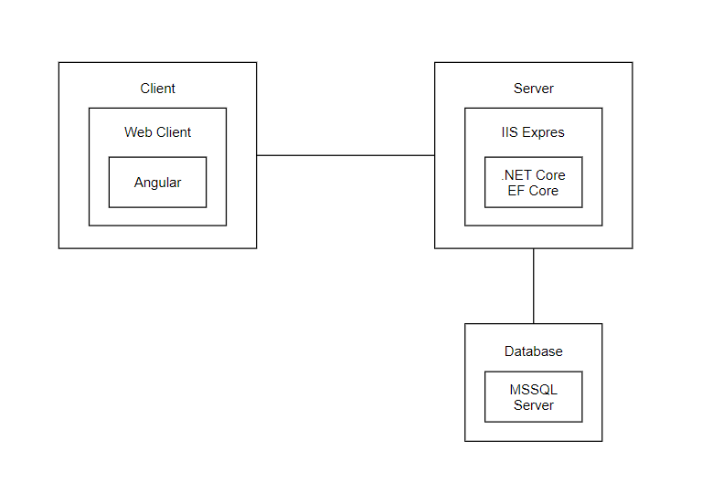

### Data Model
The database is generated using Entity Framework Core Code First approach and for the user accounts I used the table AspNetUser, AspNetRoles and AspNetUserRoles from ASP.NET Core Identity. 
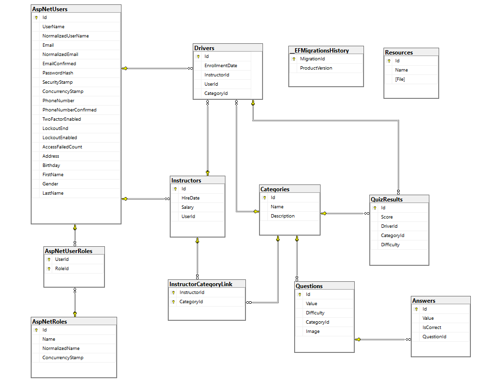

### Use Case Diagram
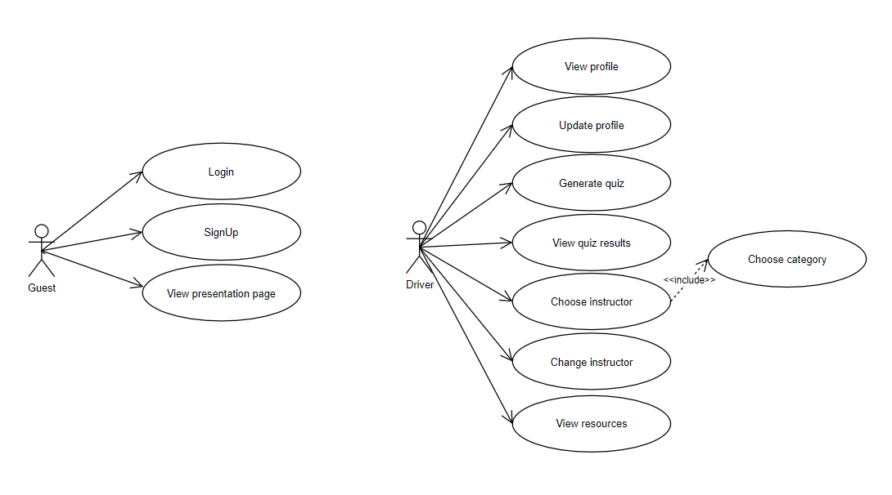
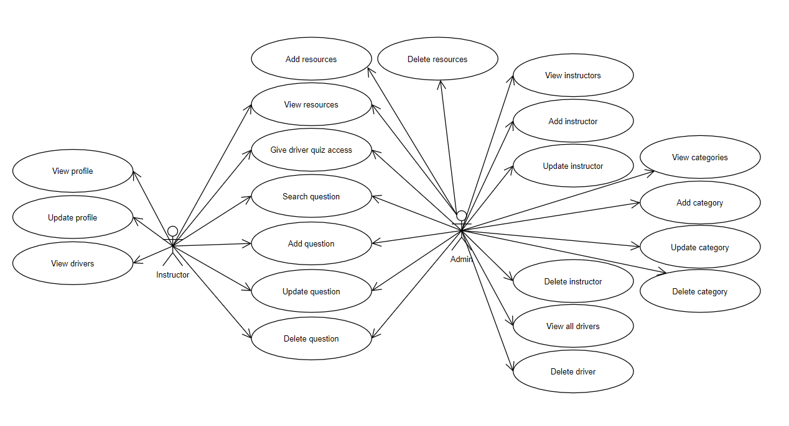

### Backend Diagram
Layers architecture contains three big layers: API, BLL, DAL:
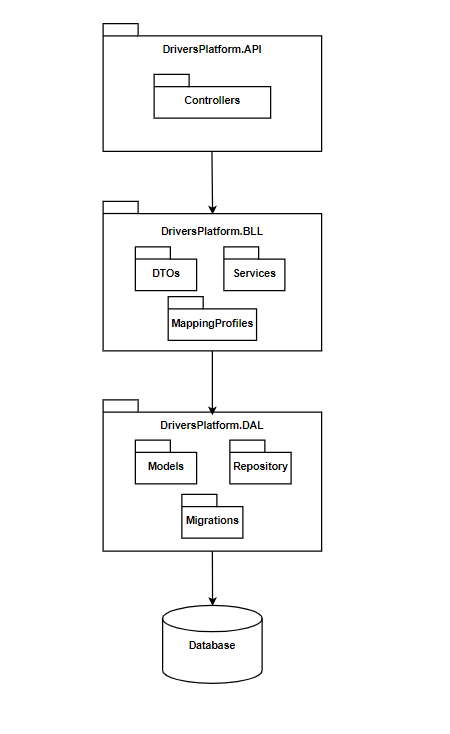

### Frontend Diagrams
Package diagram:
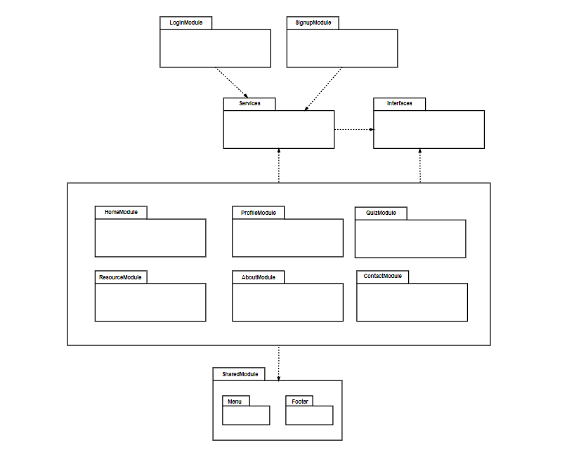

### Login Sequence Diagrams
Backend:
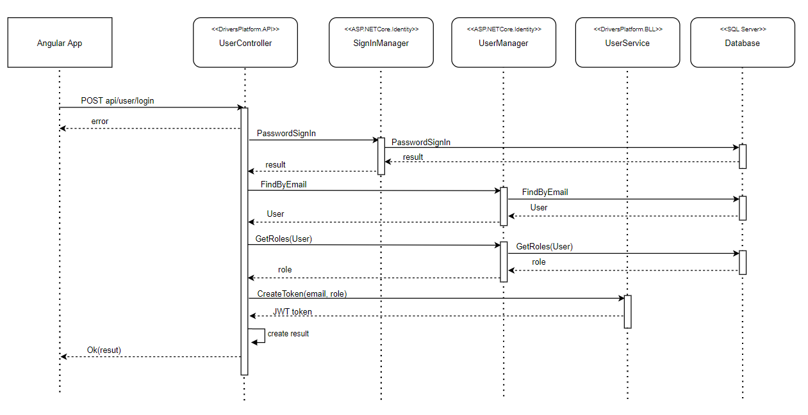

Frontend:
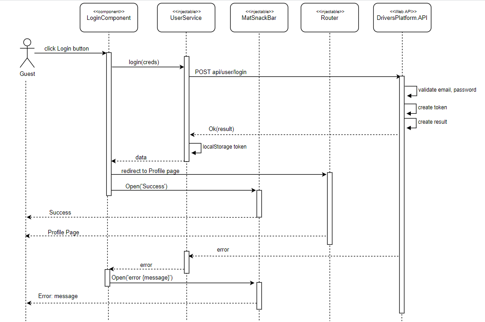

## Results
SignUp form with validations:
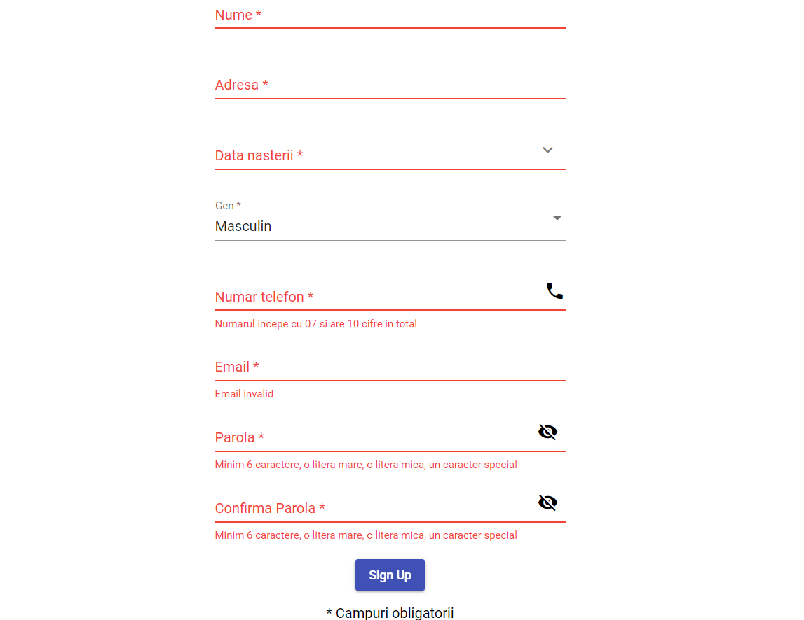

Quiz question with picture:
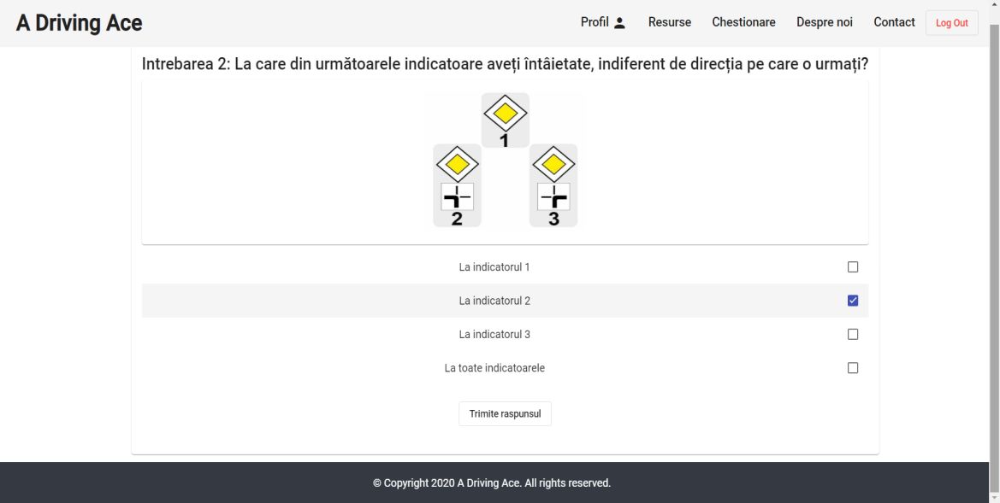

Update form using two-way binding:
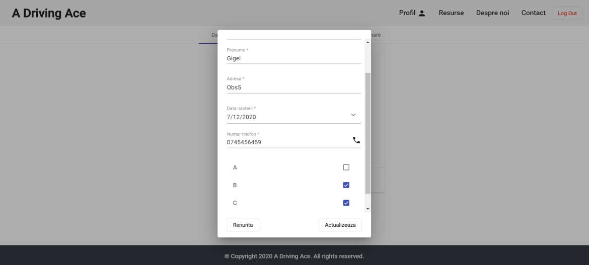

